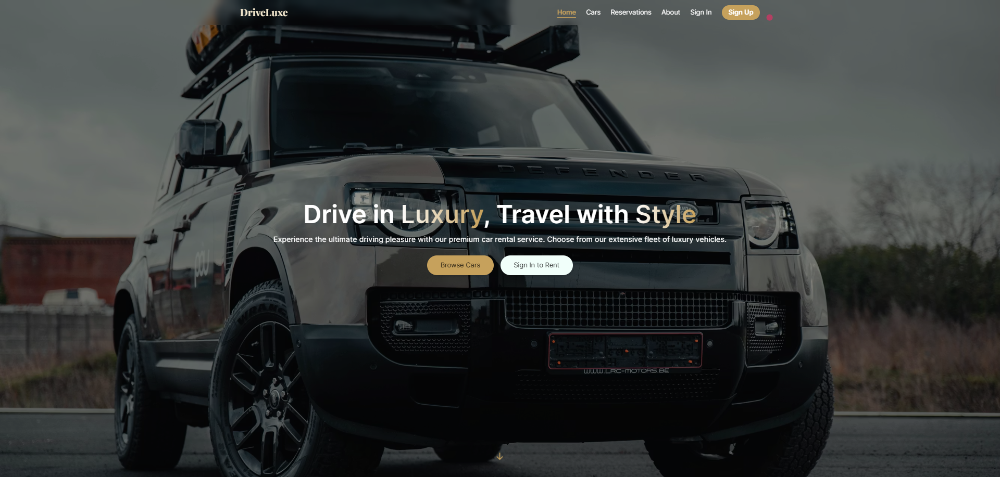
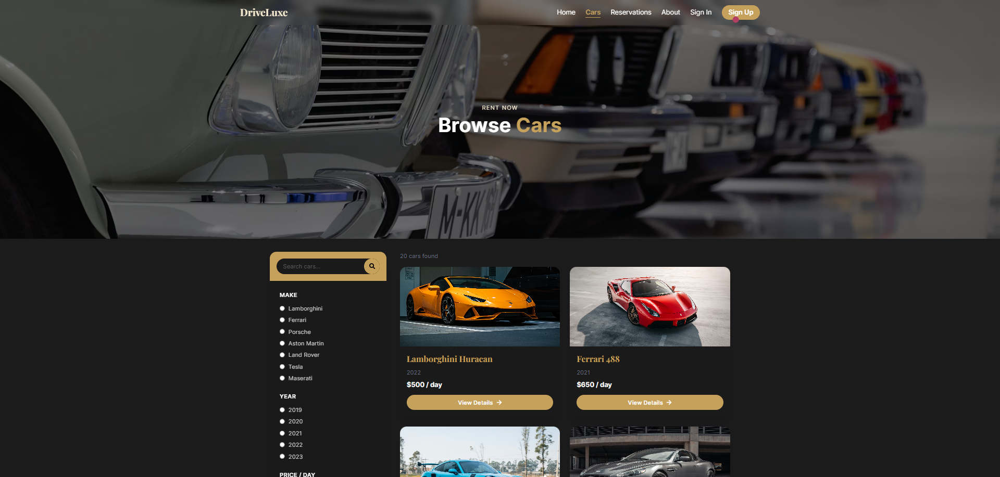
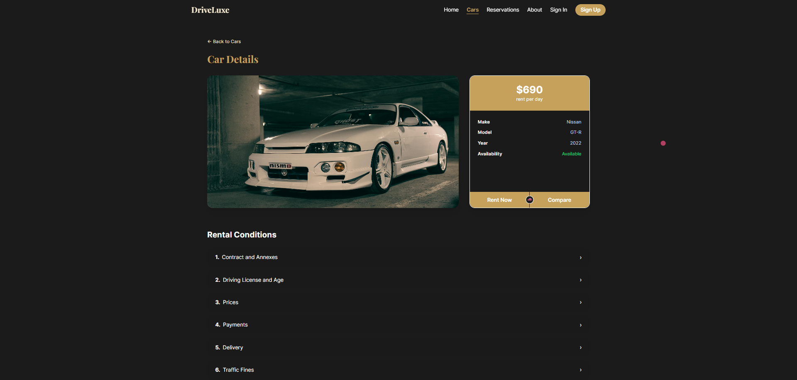
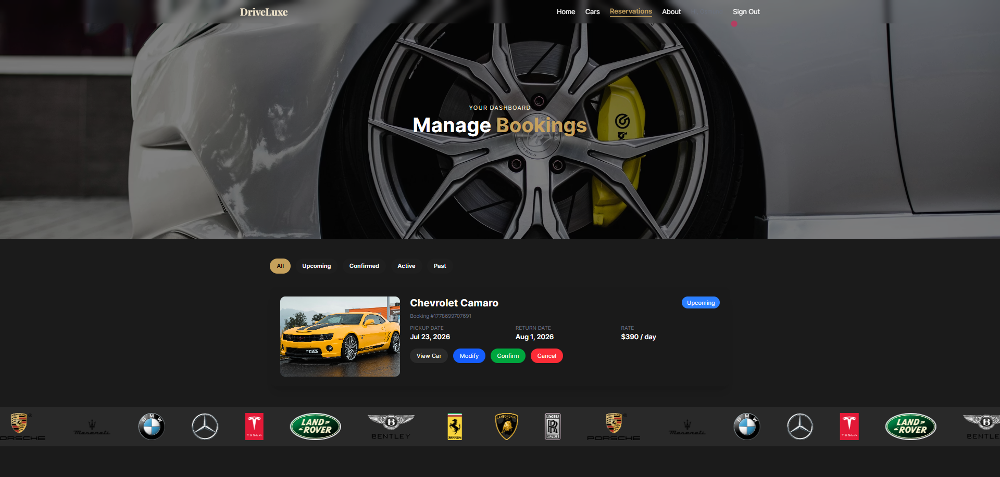
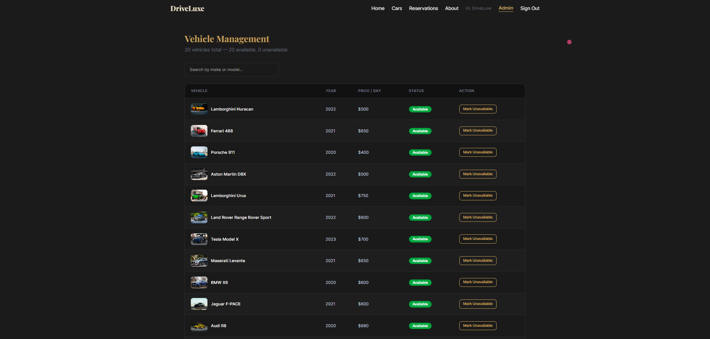
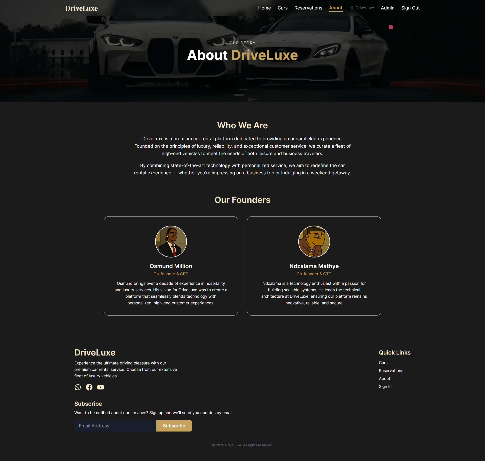

# 🚗 DriveLuxe
> Browse. Book. Drive in style.

A frontend-only luxury car rental web application. Browse a curated fleet of premium vehicles, make reservations, manage bookings, and administer the platform — all without a backend.


**[→ Live Demo](https://driveluxe.vercel.app/)**

---

## ✨ Features

- **Fleet browsing** — filter by make, price, availability, and transmission
- **Car detail pages** — full specs, rental conditions accordion, and booking modal
- **Reservations** — view, modify, and cancel bookings; stored in localStorage
- **Simulated auth** — sign up, sign in, session persistence, and role-based access
- **Admin panel** — dashboard with live stats, vehicle management, reservation management, and customer management
- **Fully responsive** — mobile-first layout with hamburger nav and filter drawer
- **Luxury aesthetic** — dark theme with gold accents, Playfair Display headings, and Framer Motion animations throughout
- **No backend** — everything runs in the browser via localStorage

---

## 📸 Preview








---

## 📁 File Structure

```
driveluxe/
├── index.html
├── package.json
├── vercel.json
├── vite.config.ts
├── tsconfig.json
└── src/
    ├── App.tsx
    ├── index.css
    ├── main.tsx
    ├── assets/
    ├── context/
    │   └── AuthContext.tsx
    ├── data/
    │   ├── carsData.ts
    │   ├── faqData.ts
    │   └── serviceData.ts
    ├── components/
    │   ├── Navbar.tsx
    │   ├── Footer.tsx
    │   ├── BookingFormModal.tsx
    │   └── ...
    └── pages/
        ├── Home.tsx
        ├── Cars.tsx
        ├── CarDetail.tsx
        ├── Reservations.tsx
        ├── Contact.tsx
        ├── About.tsx
        ├── SignIn.tsx
        ├── SignUp.tsx
        ├── ServiceDetails.tsx
        ├── NotFound.tsx
        └── admin/
            ├── AdminDashboard.tsx
            ├── VehicleManagement.tsx
            ├── ReservationManagement.tsx
            └── CustomerManagement.tsx
```

---

## 🛠️ Tech Stack

| What | Why |
|------|-----|
| React 19 | UI framework |
| TypeScript 5.8 | Type safety across the whole codebase |
| Vite 6 | Fast dev server and build tool |
| Tailwind CSS v4 | Utility-first styling with custom design tokens |
| React Router v7 | Client-side routing with protected routes |
| Framer Motion 12 | Page transitions and UI animations |
| react-icons v5 | Icon library |
| localStorage | Simulated auth, sessions, and reservations |

---

## 🎨 Design Tokens

| Token | Value | Usage |
|-------|-------|-------|
| `midnight` | `#1b1b1b` | Page backgrounds |
| `luxeGold` | `#C6A15C` | Accents, buttons, highlights |
| `champagne` | `#F5E9CF` | Soft text, hover states |
| `pearlWhite` | `#FFFFFF` | Primary text |
| `slateGray` | `#6B7280` | Secondary text, labels |
| `mintCream` | `#F1FFFA` | Subtle backgrounds |

---

## 🔐 Auth System

Auth is simulated entirely via localStorage — no backend required.

- **Sign Up** — saves user to `driveluxe_users` array in localStorage
- **Sign In** — matches credentials, strips password, saves session to `driveluxe_session`
- **Session restore** — persists across page refreshes
- **Roles** — `customer` or `admin`; admin unlocks `/admin/*` routes
- **Default admin** — seeded automatically: `admin` / `admin123`

---

## 🌐 Deployment

Deployed on Vercel. The `vercel.json` at the project root rewrites all routes to `index.html` so React Router handles navigation correctly:

```json
{
  "rewrites": [{ "source": "/(.*)", "destination": "/index.html" }]
}
```

---

## 👤 Author

Made with ♥ by **Osmund** — © 2026

---

## 📄 License

MIT — see [LICENSE](./LICENSE) for details.